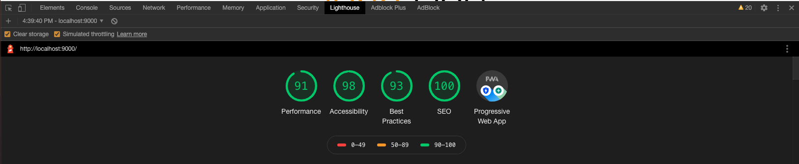
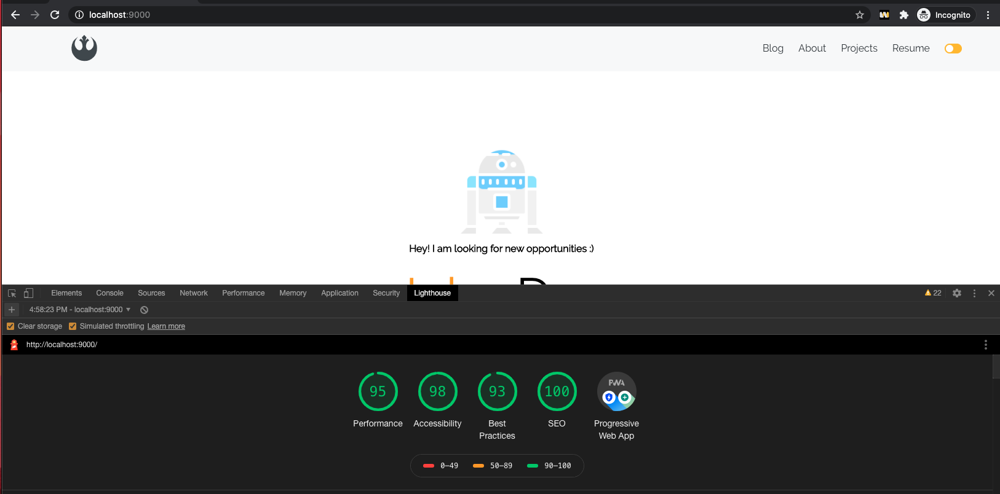
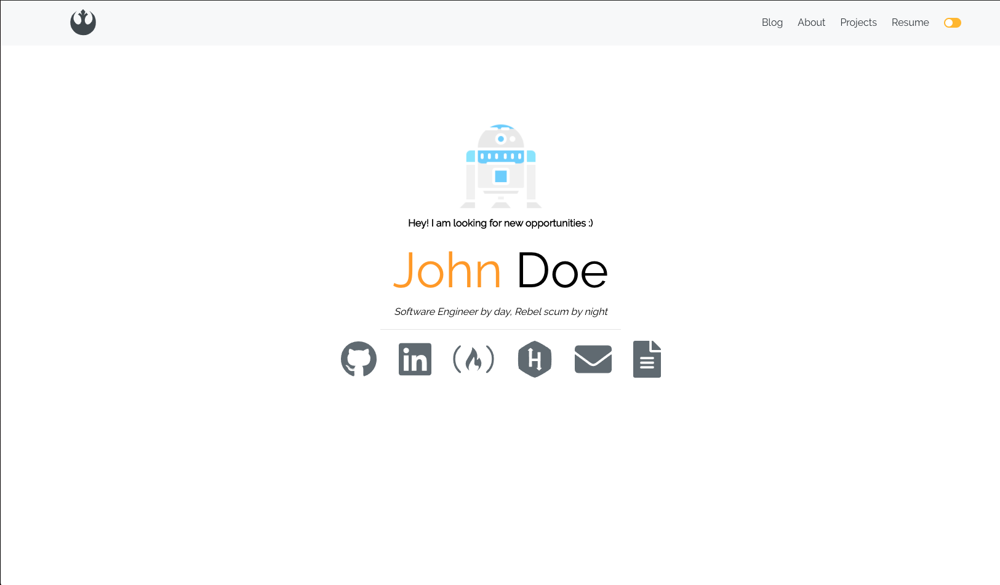
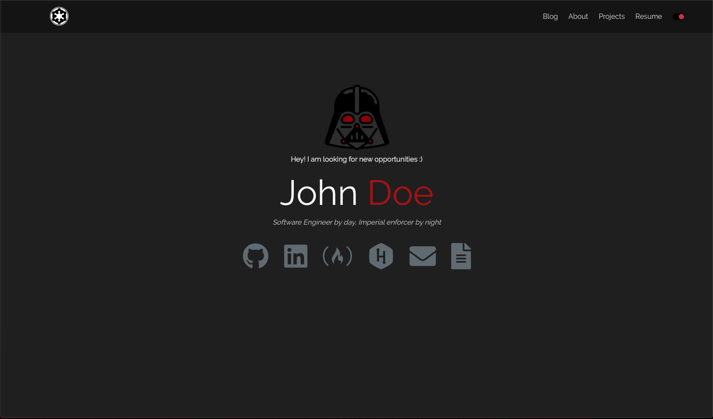

# Sudara's personal Website

Built from the [gatsby-personal-site-template](https://www.gatsbyjs.com/starters/surudhb/gatsby-personal-site-template) gatsby starter.

## 📋 Starter README

- A Gatsby starter for a minimalist portfolio with `SEO` and app theming using `React Context`, `Bootstrap` and `Sass`
- I highly recommend going through Gatsby's [tutorial](https://www.gatsbyjs.org/tutorial/) before getting started.

### What does this starter offer?

- The starter is based off of the official [hello-world](https://github.com/gatsbyjs/gatsby-starter-hello-world) starter provided.
- Everything in the starter is reconfigurable.
- This starter is really a demonstation of what Gatsby is capable of.
- Built in support for `SEO`, light/dark mode and `bootstrap`
- Starter comes with a locally hosted font `Aurebesh`, but feel free to remove/replace it
- Starter uses fontawesome icons for affiliate links
- Starter uses `gatsby-node.js` and Markdown files to programatically create pages for blog posts and projects
- Starter uses `siteMetadata` to create `About` page

### The file structure is as follows:

- **Components**: Re-usable components to be used throughout the app
- **Content**: Contains relevant markdown files and images for blog posts or projects
- **Templates**: Contains files that create the template html for a blog post or project details page
- **Styles**: Contains the sass files used for adding custom styling to the app
- **Utils**: Contains helper files, seo, and theme management
- **Pages**: Contains the different pages
- **Static**: Contains static assets (i.e. self-hosted fonts or images) that bypass gatsby pipeline

### Understanding important dependencies:

- Gatbsy recommends using its plugins whenever possible, but not always. See [documentation](https://www.gatsbyjs.org/docs/plugins/) for more details.
- Gatsby plugins are used by Gatsby's build process and provide and API for certain tasks.
- `Bootstrap` is a CSS framework that comes with already defined CSS classes
- `React Bootstrap` is an abstraction of `Bootstrap` providing some basic styling built-in to its components
- `Helmet` is used to add SEO to the site making it easier for search engines to relate search keywords to your website.
- `Fontawesome` is used for icons
- `Howler` is used to manage audio files

### Credits

- Star Wars icons: https://icons8.com/icons/
- Using Context API with Gatsby: https://www.gatsbyjs.org/blog/2019-01-31-using-react-context-api-with-gatsby/
- SEO with Gatsby: https://gregberge.com/blog/gatsby-seo
- Gatsby: https://www.gatsbyjs.org/docs/

### Lighthouse screenshots

### App Screenshots

Light Mode\

  
Dark Mode\

<!-- AUTO-GENERATED-CONTENT:START (STARTER) -->

## 🧐 What's inside?

A quick look at the top-level files and directories you'll see in a Gatsby project.

    .
    ├── node_modules
    ├── src
    ├── .gitignore
    ├── .prettierrc
    ├── gatsby-browser.js
    ├── gatsby-config.js
    ├── gatsby-node.js
    ├── gatsby-ssr.js
    ├── LICENSE
    ├── package-lock.json
    ├── package.json
    └── README.md

1.  **`/node_modules`**: This directory contains all of the modules of code that your project depends on (npm packages) are automatically installed.

2.  **`/src`**: This directory will contain all of the code related to what you will see on the front-end of your site (what you see in the browser) such as your site header or a page template. `src` is a convention for “source code”.

3.  **`.gitignore`**: This file tells git which files it should not track / not maintain a version history for.

4.  **`.prettierrc`**: This is a configuration file for [Prettier](https://prettier.io/). Prettier is a tool to help keep the formatting of your code consistent.

5.  **`gatsby-browser.js`**: This file is where Gatsby expects to find any usage of the [Gatsby browser APIs](https://www.gatsbyjs.org/docs/browser-apis/) (if any). These allow customization/extension of default Gatsby settings affecting the browser.

6.  **`gatsby-config.js`**: This is the main configuration file for a Gatsby site. This is where you can specify information about your site (metadata) like the site title and description, which Gatsby plugins you’d like to include, etc. (Check out the [config docs](https://www.gatsbyjs.org/docs/gatsby-config/) for more detail).

7.  **`gatsby-node.js`**: This file is where Gatsby expects to find any usage of the [Gatsby Node APIs](https://www.gatsbyjs.org/docs/node-apis/) (if any). These allow customization/extension of default Gatsby settings affecting pieces of the site build process.

8.  **`gatsby-ssr.js`**: This file is where Gatsby expects to find any usage of the [Gatsby server-side rendering APIs](https://www.gatsbyjs.org/docs/ssr-apis/) (if any). These allow customization of default Gatsby settings affecting server-side rendering.

9.  **`LICENSE`**: Gatsby is licensed under the MIT license.

10. **`package-lock.json`** (See `package.json` below, first). This is an automatically generated file based on the exact versions of your npm dependencies that were installed for your project. **(You won’t change this file directly).**

11. **`package.json`**: A manifest file for Node.js projects, which includes things like metadata (the project’s name, author, etc). This manifest is how npm knows which packages to install for your project.

12. **`README.md`**: A text file containing useful reference information about your project.

## 🎓 Learning Gatsby

Looking for more guidance? Full documentation for Gatsby lives [on the website](https://www.gatsbyjs.org/). Here are some places to start:

- **For most developers, we recommend starting with our [in-depth tutorial for creating a site with Gatsby](https://www.gatsbyjs.org/tutorial/).** It starts with zero assumptions about your level of ability and walks through every step of the process.

- **To dive straight into code samples, head [to our documentation](https://www.gatsbyjs.org/docs/).** In particular, check out the _Guides_, _API Reference_, and _Advanced Tutorials_ sections in the sidebar.

<!-- AUTO-GENERATED-CONTENT:END -->
